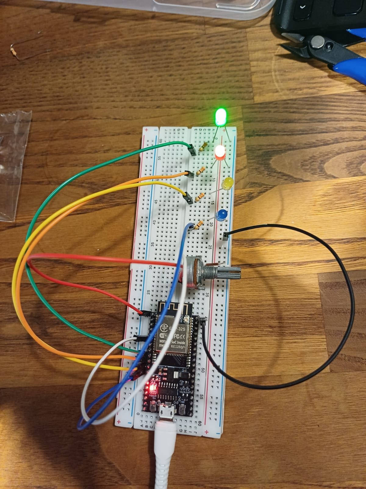

# ESP32 LED Sine Wave Project

This project demonstrates controlling the **brightness of 4 LEDs in a sine wave pattern** using an ESP32.  
A potentiometer is used to adjust the wave speed, and a **phase difference** is applied between LEDs to create a flowing wave effect.

## Key Features

| Feature | Description |
|---------|-------------|
| Potentiometer-controlled speed | Adjust the LED wave speed in real-time |
| Phase difference between LEDs | 90° phase shift creates flowing wave effect |
| Sine wave brightness control | LED brightness follows a sine wave pattern |

## Hardware Required

| Component | Quantity |
|-----------|---------|
| ESP32 development board | 1 |
| LED | 4 |
| Resistor (appropriate for LEDs) | 4 |
| Potentiometer | 1 |
| Breadboard & jumper wires | As needed |

## Code

```cpp
const int potPin = 35;
const int ledPins[] = {25, 26, 27, 14};
const int numLeds = 4;

float currentPhase = 0.0;

const int freq = 5000;       // PWM frequency
const int resolution = 8;    // 8-bit resolution (0-255)

void setup() {
  pinMode(potPin, INPUT);

  for(int i = 0; i < numLeds; i++) {
    ledcAttach(ledPins[i], freq, resolution);
  }
}

void loop() {
  int potValue = analogRead(potPin);
  float speed = map(potValue, 0, 4095, 1, 100) / 100.0;

  currentPhase += speed;
  if(currentPhase > 2*PI) currentPhase -= 2*PI;

  for(int i = 0; i < numLeds; i++) {
    float ledPhase = currentPhase - (i * PI/2);
    float wave = sin(ledPhase);

    if(wave < 0) wave = 0;

    int brightness = wave * 255;
    ledcWrite(ledPins[i], brightness);
  }

  delay(10);
}
## Circuit Photo


